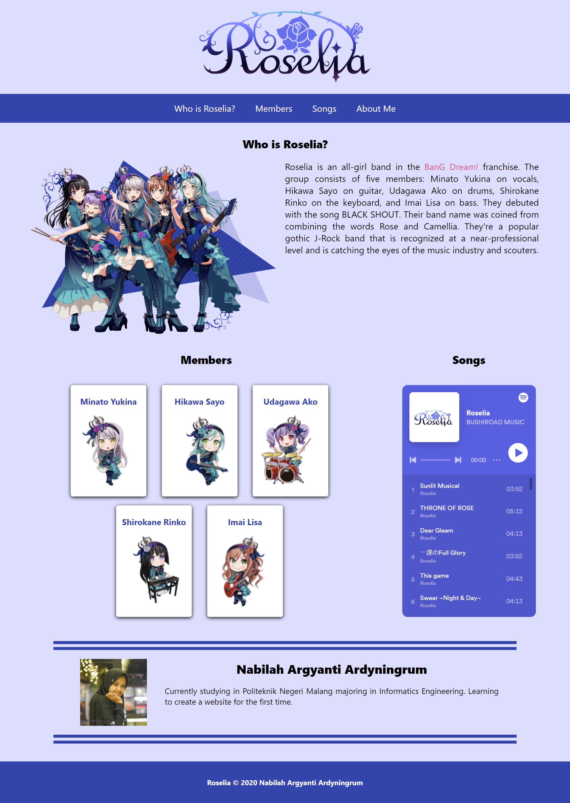

# Introduction to Roselia from BanG Dream

This project is the result of the submission for the [Belajar Dasar Pemrograman Web](https://www.dicoding.com/academies/123) course at Dicoding. It's a website that introduces Roselia, a band within the BanG Dream franchise.

## Features

- Utilizes HTML, CSS, and JavaScript to create an interactive web page.
- Introduces who Roselia is and its members.
- Lists Roselia's songs from Spotify.

## Technologies Used

- HTML
- CSS
- JavaScript

## Installation and Usage

1. Clone this repository to your local directory.

    ```bash
    git clone https://github.com/nargyanti/Roselia.git
    ```

2. Open the `index.html` file using your preferred web browser.
3. You can explore different sections of the page to understand more about Roselia.

## Screenshots


